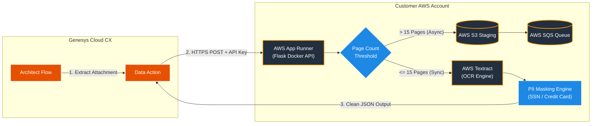

Here is the complete, customer-facing `README.md` for your **Genesys Cloud OCR Blueprint** package.

```markdown
# Genesys Cloud Data Action OCR Blueprint

A production-ready, automated OCR pipeline that extracts structured text from multi-page PDFs and images uploaded in Genesys Cloud Web Chat, Messaging, and Email interactions. 

This blueprint deploys an isolated, high-performance Python Flask microservice powered by **AWS Textract** into **your own AWS account** via Terraform, and automatically configures the corresponding **Genesys Cloud Data Action** and **Architect Flow**.

---

## Architecture Overview


```

```
                                  YOUR AWS ACCOUNT
                          ┌───────────────────────────────┐
                          │  AWS App Runner               │
                          │  ┌─────────────────────────┐  │

```

┌──────────────────────┐      │  │ Python Flask Microservice│  │      ┌─────────────────┐
│ Genesys Cloud        │      │  │ (Docker Container)      │  │─────>│ AWS Textract    │
│ Architect / Action   │─────>│  └─────────────────────────┘  │      │ (OCR Engine)    │
└──────────────────────┘      │               ▲               │      └─────────────────┘
HTTPS / API Key          │               │               │
└───────────────┼───────────────┘
│
Automated Deployment
(Terraform & Archy)

```

### Key Features
- **Multi-Page PDF & Image Support:** Automatically splits multi-page PDFs in-memory and returns page-by-page as well as aggregated text.
- **Automated PII Redaction:** Integrated regex filters mask Social Security Numbers (SSNs) and Credit Card numbers prior to returning payloads to Genesys Cloud.
- **Zero Data Lock-in / $0 Hosting Overhead for Vendors:** Runs entirely within your security boundary—no third-party data retention or external SaaS fees.
- **End-to-End Automation:** Deploys infrastructure and Genesys configurations in under 5 minutes using Terraform and Archy.

---

## Prerequisites

Before deploying, ensure you have the following tools installed and configured:

1. **AWS CLI** (v2.x)
   - Configured with administrative rights: `aws configure`
2. **Terraform CLI** (v1.5.0+)
   - [Download Terraform](https://developer.hashicorp.com/terraform/downloads)
3. **Archy CLI** (Genesys Architect CLI)
   - Installed and authenticated: `archy login`
4. **Genesys Cloud OAuth Client Credentials**
   - Requires roles: `Data Actions > All permissions`, `Architect > Flow > All permissions`.
5. **AWS ECR Public Image Access**
   - The default configuration pulls the pre-built container image from AWS ECR Public.

---

## Estimated AWS Running Costs

Because this solution uses AWS App Runner and pay-per-use AWS Textract, costs scale directly with volume:

| Resource | Pricing Model | Estimated Cost |
| :--- | :--- | :--- |
| **AWS App Runner** | ~$0.007 / vCPU hour (When active, pauses when idle) | ~$5.00 / month (Low/Medium volume) |
| **AWS Textract** | $1.50 per 1,000 pages processed | $0.0015 / page |

---

## Quick-Start Deployment Guide (Under 5 Minutes)

### Step 1: Clone or Download the Blueprint
```bash
git clone [https://github.com/your-repo/genesys-cloud-ocr-blueprint.git](https://github.com/your-repo/genesys-cloud-ocr-blueprint.git)
cd genesys-cloud-ocr-blueprint

```

### Step 2: Configure Infrastructure & Deploy via Terraform

1. Navigate to the `terraform/` directory:
```bash
cd terraform

```


2. Copy the example variables file:
```bash
cp terraform.tfvars.example terraform.tfvars

```


3. Edit `terraform.tfvars` with your specific details:
```hcl
aws_region          = "us-east-1"
ocr_api_key         = "your-secure-custom-api-key-here"
genesys_client_id     = "YOUR_GENESYS_OAUTH_CLIENT_ID"
genesys_client_secret = "YOUR_GENESYS_OAUTH_CLIENT_SECRET"
genesys_aws_region  = "us-east-1" # e.g., us-east-1, eu-west-1

```


4. Initialize and apply the Terraform plan:
```bash
terraform init
terraform apply -auto-approve

```


> **Output Note:** Save the `app_runner_url` emitted at the end of the execution.

---

### Step 3: Deploy the Genesys Architect Flow using Archy

1. Navigate to the `archy/` directory:
```bash
cd ../archy

```


2. Authenticate Archy with your Genesys Cloud organization (if not already logged in):
```bash
archy login --clientId YOUR_CLIENT_ID --clientSecret YOUR_CLIENT_SECRET --region mypurecloud.com

```


3. Import and publish the inbound message flow:
```bash
archy create --file ocr_flow.yaml

```


---

## Testing Your Setup

1. **Service Health Check:**
Verify your AWS App Runner container is running by querying its `/health` route:
```bash
curl https://<YOUR-APP-RUNNER-URL>[.awsapprunner.com/health](https://.awsapprunner.com/health)

```


*Expected Response:* `{"status": "UP"}`
2. **Test End-to-End Execution in Genesys:**
* Go to **Genesys Cloud > Admin > Integrations > Actions**.
* Select **OCR Attachment Text Extractor**.
* Click **Test Action**, provide a publicly accessible PDF URL in `fileUrl`, and click **Execute**.


---

## Troubleshooting & Common Issues

| Symptom / Error | Root Cause | Solution |
| --- | --- | --- |
| **`401 Unauthorized` on Data Action execution** | The `X-API-KEY` in Genesys Data Action header does not match `ocr_api_key` in `terraform.tfvars`. | Update the header in Genesys Cloud Data Actions config or rerun `terraform apply` with matching keys. |
| **Data Action Timeout (`734` / `REST call timed out`)** | Genesys Data Actions timeout after **15 seconds**. High-page count PDFs (15+ pages) may exceed this window. | Lower the resolution/DPI in `app/app.py` or limit incoming document page limits in Architect prior to triggering the Data Action. |
| **`400 Bad Request: Failed to download attachment`** | The attachment URL provided by Genesys requires authentication or has expired. | Ensure `Message.Message.attachments[0].contentUrl` is passed directly from the active interaction scope. |
| **App Runner container failing to start** | Insufficient IAM permissions for AWS Textract. | Verify that `aws_iam_role_policy_attachment` in `terraform/main.tf` has attached `AmazonTextractFullAccess` to the App Runner instance. |

---

## Customization & Advanced Options

* **Custom PII Masking Rules:** Add or update regular expressions in `app/app.py` under `SSN_REGEX` or `CREDIT_CARD_REGEX` to mask custom domain data (e.g., Policy Numbers, Account IDs).
* **Asynchronous Processing:** For multi-page documents taking longer than 15 seconds, refer to `docs/ARCHITECTURE.md` to review the SQS/S3 async polling configuration model.

---

## Support & License

* **License:** Proprietary / License agreement granted upon package purchase.
* **Support:** For technical support or customization inquiries, contact `support@yourdomain.com`.
